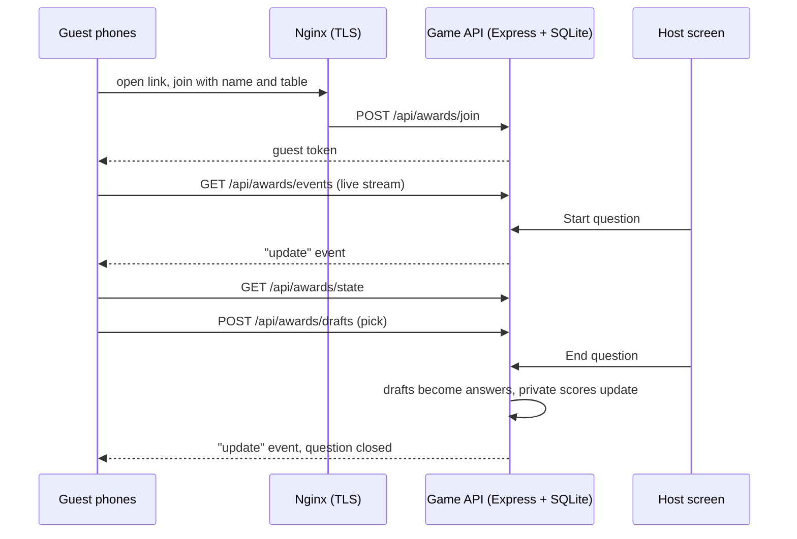

<div align="center">


# Guess the Winner

**A live, phone-first prediction game for award ceremonies.**
Guests scan a QR code, pick who they think will win each category, and the host runs the night from one screen.


[Features](#-features) · [Quick start](#-quick-start) · [Your own awards](#%EF%B8%8F-set-up-your-own-awards) · [Configuration](#%EF%B8%8F-configuration) · [Testing](#-testing) · [Deployment](#-deployment) · [Runbook](#-event-night-runbook)

</div>

---

## ✨ Features

### For guests

- **Join in seconds.** Scan a QR code, enter a name and table number, and you're in. No app and no account.
- **One pick per category.** The selection saves instantly as a draft, and can change until the host ends the question.
- **Always in sync.** A live event stream moves every phone to the current question or round screen within a second.
- **A proper finish.** When the host ends the game, every phone shows a closing page.

### For the host (`/host` in production, `/awards` locally)

| Screen | What you can do |
|---|---|
| **Game control** | Show a round introduction, start and end each question, and see live counts of saved selections and submitted answers. **End the game** when all questions are done. |
| **Categories & nominees** | Rename categories and companies, upload logos, and **tick the correct answer** for any category. Several nominees can be correct. |
| **Private results** | Players ranked from highest to lowest score, per-round totals and CSV export. The winner's name and table are shown, with a **tie-break raffle** among players tied for first. |
| **Participants** | Everyone who joined, with their table numbers. |
| **QR code** | A large join QR code and link to put on the venue screens. |
| **Game settings** | **Edit every sentence, placeholder and colour guests see**, and the banner logo, with a live phone preview. Clear all answers and participants with a two-step confirmation. |

### Under the hood

- **Private by design.** Correct answers, scores and raffle results never reach guest phones.
- **Fair raffle.** The draw uses cryptographic randomness on the server, is stored with the game, and records each redraw.
- **Durable.** SQLite in WAL mode, with batched atomic writes. A restart keeps every player, answer and setting.
- **Built for crowds.** Tested with 500 devices opening the link in the same second, then all refreshing together after each host action.

---

## 🧭 How it works



---

## 🚀 Quick start

**Requires Node.js 22.13 or newer.** Node 24 is recommended. The game uses the built-in `node:sqlite` module.

```bash
git clone git@github.com:ahmadtello/guess-the-winner.git
cd guess-the-winner
npm install
```

1. **Create an answer key for the bundled sample awards.** This marks the first nominee of each category as correct. You can change the ticks later in the host screen.

   ```bash
   node -e "const s=require('./src/awards-shortlist.json');require('fs').mkdirSync('.private',{recursive:true});require('fs').writeFileSync('.private/awards-answer-key.json',JSON.stringify({dataset:s.dataset,winners:Object.fromEntries(s.categories.map(c=>[c.id,[c.nominees[0].id]]))}))"
   ```

2. **Start the game API.** Outside production it generates a host password and saves it in `.private/host-access.txt`.

   ```bash
   npm run api
   ```

3. **Start the web app** in a second terminal.

   ```bash
   npm run dev
   ```

4. **Open the game.**
   - Host: http://localhost:5173/awards, signing in with the password from `.private/host-access.txt`
   - Guest: http://localhost:5173/awards/play. Open it in a few browser tabs, or on phones on the same network.

---

## 🏷️ Set up your own awards

### 1. Import your shortlist

Prepare a CSV where the first column is `Question` and the eighth column is `Correct Answer(s)`. Each row is one category:

- **Column 1** reads like `Who won in this category: Innovation Awards - Innovation of the Year?`. The text before ` - ` becomes the **round**, and the text after it becomes the **category**.
- **Column 8** holds the correct answer. Separate joint winners with `@@@`.
- **Columns 9 onwards** hold the other nominees, one per column.

Put one logo per company in a folder, named after the company in lower case with dashes. For example, `Blue Harbor Services` becomes `blue-harbor-services.png`, and `.jpg`, `.webp` or `.svg` also work.

```bash
node scripts/import-awards-shortlist.mjs path/to/shortlist.csv path/to/logos my-awards-2027
```

This writes `src/awards-shortlist.json`, copies the logos to `public/awards/nominees/`, and writes the private answer key to `.private/awards-answer-key.json`. The key is never included in the browser build.

> [!IMPORTANT]
> The dataset ID (`my-awards-2027` above) is stored in the game database. The server refuses to start if the shortlist and database belong to different datasets. Use a new ID and a fresh storage folder for each event.

### 2. Make it yours

Everything guests read can be changed in **Game settings → Text and appearance**: the join headline, form labels and placeholders, round and question wording, notices, closing page, footer, the ten guest colours and the banner logo. Leave a field empty to keep the default wording. Placeholders such as `{name}`, `{table}`, `{round}`, `{question}` and `{total}` are filled in automatically.

To change the logo shipped with the app, replace `public/brand/logo.svg`.

### 3. Create the join QR code

```bash
node scripts/create-awards-qr.mjs https://game.example.com/
```

This writes `public/awards/join-qr.png` and checks that it scans back to the same address. The host **QR code** screen and `public/awards/join-screen.html` use it.

> [!TIP]
> **Before a big event, add logos as files rather than through the host editor.** Logos uploaded in **Categories & nominees** are stored inside the game state that every phone downloads on each refresh. A handful of them can make each refresh many times larger. Put logos in `public/awards/nominees/` instead.

---

## ⚙️ Configuration

### Server (`/etc/guess-the-winner.env` in production)

| Variable | Required | Default | Purpose |
|---|:---:|---|---|
| `NODE_ENV` | ✅ prod | | Set to `production` on the server. |
| `AWARDS_ADMIN_PASSWORD` | ✅ prod | generated locally | Host password. At least 16 characters. |
| `AWARDS_STORAGE_DIR` | ✅ prod | `.private/` | Folder for `awards.sqlite`, the answer key and secrets. |
| `AWARDS_ALLOWED_ORIGINS` | ✅ prod | localhost dev origins | Comma-separated origins allowed to change data, for example `https://game.example.com`. |
| `AWARDS_ANSWER_KEY_FILE` | | `<storage>/awards-answer-key.json` | Answer key location. |
| `AWARDS_SESSION_SECRET` | | generated and stored | Signs host sessions and guest tokens. |
| `AWARDS_PORT` | | `8788` | API port on `127.0.0.1`. |

### Build

| Variable | Purpose |
|---|---|
| `VITE_GAME_HOSTNAME` | Your public hostname, for example `game.example.com`. On that host, guests use `/` and the host uses `/host`. Anywhere else, including local dev, the routes are `/awards/play` and `/awards`. |

```bash
VITE_GAME_HOSTNAME=game.example.com npm run build   # output in dist-awards/
```

---

## 🧪 Testing

```bash
npm test                  # unit tests for the game model
npm run test:load         # 500 players, 6,000 answers, lock race and restart recovery on a local server
```

### Same-second open test

`tests/awards-open-burst.mjs` replays what a real phone does when it opens the link. It loads the page and bundles, fetches state and opens the live stream. Then every device refreshes at once, three times, as happens on each Start or End question. It only reads; nothing is written.

```bash
AWARDS_OPEN_BASE=https://game.example.com AWARDS_OPEN_N=500 npm run test:open-burst
```

Results go to `output/awards-open-burst-*.json`.

---

## 📦 Deployment

Templates are in `deploy/`.

| File | Use |
|---|---|
| `deploy/nginx-game.conf` | HTTPS site: static build, `/api/awards/` proxy with buffering off for the live stream, security headers, cache rules. Replace `game.example.com`. |
| `deploy/guess-the-winner.service` | Hardened systemd unit running `server/awards-server.js` as an unprivileged user. |
| `deploy/awards-package.json` | Minimal server `package.json` (Express and Helmet only). |

**First install on Ubuntu** (replace `game.example.com` throughout):

```bash
# 1. Service user, code and data folders
sudo useradd --system --home /var/lib/guess-the-winner --shell /usr/sbin/nologin guess-the-winner
sudo install -d -o guess-the-winner -g guess-the-winner -m 0700 /var/lib/guess-the-winner
sudo install -d /opt/guess-the-winner/server /opt/guess-the-winner/src
sudo cp server/awards-server.js /opt/guess-the-winner/server/
sudo cp src/awards-shortlist.json /opt/guess-the-winner/src/
sudo cp deploy/awards-package.json /opt/guess-the-winner/package.json
(cd /opt/guess-the-winner && sudo npm install --omit=dev)

# 2. Private answer key and environment
sudo install -o guess-the-winner -g guess-the-winner -m 0600 .private/awards-answer-key.json /var/lib/guess-the-winner/
printf 'NODE_ENV=production\nAWARDS_STORAGE_DIR=/var/lib/guess-the-winner\nAWARDS_ALLOWED_ORIGINS=https://game.example.com\nAWARDS_ADMIN_PASSWORD=%s\n' "$(openssl rand -hex 24)" | sudo tee /etc/guess-the-winner.env >/dev/null
sudo chmod 600 /etc/guess-the-winner.env

# 3. Web files, Nginx and service
VITE_GAME_HOSTNAME=game.example.com npm run build
sudo install -d /var/www/game.example.com/htdocs
sudo cp -r dist-awards/. /var/www/game.example.com/htdocs/
sudo cp dist-awards/awards.html /var/www/game.example.com/htdocs/index.html
sudo cp deploy/nginx-game.conf /etc/nginx/sites-available/game.example.com
sudo ln -s /etc/nginx/sites-available/game.example.com /etc/nginx/sites-enabled/
sudo nginx -t && sudo systemctl reload nginx
sudo cp deploy/guess-the-winner.service /etc/systemd/system/
sudo systemctl daemon-reload && sudo systemctl enable --now guess-the-winner
curl -fsS http://127.0.0.1:8788/api/awards/health
```

The host password is in `/etc/guess-the-winner.env`.

**Updates:** build, then copy only the new files from `dist-awards/assets/` plus `index.html`. Copy `server/awards-server.js` and restart the service only when server code changed.

> [!CAUTION]
> Don't copy the whole build over a live site where logos or artwork were changed on the server, or it will overwrite them. Nginx may also serve a replaced `index.html` from its file cache for up to two minutes.

---

## 🎤 Event-night runbook

**Before doors open**

- [ ] Every category has its correct answer ticked in **Categories & nominees**.
- [ ] No nominee logo was uploaded through the editor, or those uploads were converted to files.
- [ ] The open-burst test passes against the live address.
- [ ] Test players were removed with **Game settings → Clear all answers and participants**.
- [ ] The join QR code is on the venue screens.

**During the show**

1. **Show round introduction** for round 1.
2. For each category: **Start question**, wait for the saved-selection count, then **End question**.
3. Repeat for each round.
4. **End the game.** Every phone shows the closing page.

**After the last award**

- Open **Private results** and read out the winner's name and table.
- If first place is tied, press **Draw the winner** in the tie-break raffle.
- **Export results** to keep a CSV.

---

## 🗂️ Project structure

```text
.
├── awards.html                 Production entry
├── index.html                  Local dev entry (same app)
├── src/
│   ├── awards-main.jsx         Boots the app
│   ├── AwardsGame.jsx          Host studio, routing, sign-in
│   ├── AwardsGuest.jsx         Guest screens
│   ├── AwardsHostControls.jsx  Round and question desk
│   ├── awards-theme.js         Editable wording and colour defaults
│   ├── awards-live-model.js    Client-side game model helpers
│   ├── use-awards-service.js   API client and live stream
│   └── awards-shortlist.json   Rounds, categories and nominees
├── server/awards-server.js     API: sessions, drafts, scoring, raffle, theme, SQLite
├── public/                     Logo, nominee logos, join screen, fonts
├── scripts/                    Shortlist import and QR code generator
├── tests/                      Unit, local load and open-burst tests
└── deploy/                     Nginx, systemd and server package templates
```

---

## 🔒 Security notes

- The API listens on loopback only, behind Nginx, as an unprivileged user in a hardened systemd sandbox.
- Host sessions use HttpOnly, SameSite cookies, and the host password is hashed with scrypt.
- Every write needs an allowed origin and a custom request header. Clearing the game needs two confirmations bound to the same host session.
- Guest state is stripped of answers, scores, raffle results and the answer key before it leaves the server.
- `.private/`, databases, environment files and test output are git-ignored.
